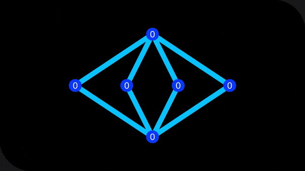

# VideoEditor

A video editing software used to create animations and data visualizations.

## This project is...
a video editor software to construct animations and visualizations using Unity (I am aware that Unity probably isn't the best framework for this type of project, but I am familiar with Unity and it works good enough for my desires). In this software I take elements, which are sprites or text, and apply actions to the elements that have the capabilities of moving, scaling, rotating, recoloring, and transforming. The animations are generated by coding the animation behaviors directly or by editing the values of preconstructed elements. In play mode there are GUI elements used to play/pause, fast forward, skip, rewind, and scroll through the animation of the video. I am currently working to create a video full of animations and visualizations to test the capabilities and workflow process in using the application.

## Use this project...
at your own risk. I had only intended this project for personal use, but I made this public in the case that someone was interested or found it useful. Having said that, I'm not familiar with how others could upload this project to their own computer. I use the Unity engine alongside the Text Mesh Pro library and the FFmpeg algorithm to create the video, so given this information if you are able to figure out how to download these things correctly and implement them then feel free to use and share this project as you please.

